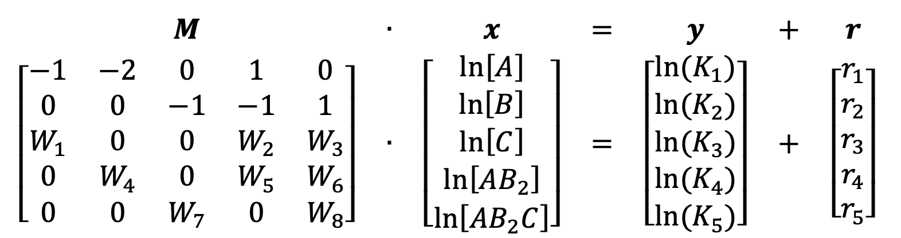

# Summary

Determining the distribution of multiple chemical species at equilibrium for a given system is a common problem that must be routinely addressed by scholars. While simple systems consisting of a few species and reactions can be solved manually, most of these problems require the definition and solution of higher-order equations and are intractable without reliable numerical methods, that can be slow and inefficient. In this work, we present straightforward Python and MATLAB implementations of the geometric-programming algorithm developed by Thomas Wayne Wall (1984) and we provide clear and easy-to-use scripts and examples for researchers approaching the problem. The performance and stability of the algorithm is tested versus out-of-the-box MATLAB numerical solver (*vpasolve*) and the solver available in chempy, showing a speed-up as high as two orders of magnitudes.

# Statement of need

`equpy` is a Python package specialized in solving multiple chemical equilibria.
`equpy` was designed to provide a user-friendly experience for a class-based
implementations of the algorithm developed by Thomas Wayne Wall to handle the
solution of mixed linear/non-linear systems of equations describing the simultaneous
equilibration of multiple species reacting in a close system. `equpy` relies 
on numpy to handle data in matrix form and matplotlib to generate figures.

`equpy` was designed to be used by chemical, biological and physical/chemical
researchers studying systems comprising multiple species reacting/interacting.
This tool is particularly well-suited for researchers that (i) need to quickly 
calculate equilibria with a matrix-form input, and/or (ii) cannot rely on 
slower and more general solvers, for example when multiple kinetic traces have 
to be integrated as the species equilibrate and/or global fits on large sets 
of parameters have to be performed.

# Introduction
The mathematical treatment of multiple chemical equilibria is a problem that can be intimidating for inexperienced researchers and community members that are not familiar with computer science and linear algebra. While tutorials for the solution of simple systems are readily available on basic chemistry textbooks and online resources, the task of upscaling these is non-trivial.
While open source or commercial packages and standalone software are available to address this task, such as Cantera, EQS4WIN, TOMSYM, COMSOL and chempy, these often rely on black-box solvers and may require some background in coding and potentially inconvenient input requirements, needing to write the set of reactions and mass conservations in extended form that may not be well-suited for automated processes.
In this work, we focus on the implementation of an approach developed by Thomas Wayne Wall [@TWW:1984; @TWW:1986] for linearization and solution of the system of equations describing a complex set of chemical reactions. The compact scripts provided here accept as inputs the reaction stoichiometry matrix, the associated array of equilibrium constants, mass conservation matrix and associated array of amounts of starting materials. All of these are conveniently input as matrices and arrays and in the examples provided here these and can be directly read through .csv files editable using common software such as Microsoft Excel, Apple Numbers, Apache OpenOffice Calc and LibreOffice Calc.

In the first section of this work, we define the general problem, in the second section we present the general mathematical treatment and implementation of the algorithm, and finally in the last section we present practical examples, focused to readers that primarily need to apply this implementation to solve their own problem, and we discuss usage and performance of the algorithm, with attention to real case scenarios and applications for the unexperienced reader.

# Problem Definition
Let’s start with a simple example of interacting species:
\begin{equation} \nonumber
A + 2B \Longleftrightarrow AB_2
\end{equation}
\begin{equation} \nonumber
AB_2 + C \Longleftrightarrow AB_2C
\end{equation}

And their associated equilibrium constants, defined as the ratio between forward and backward reaction rates:
\begin{equation}\label{eq:1}
\frac{[AB_2]}{[A][B]^2} = K_1
\end{equation}
\begin{equation}\label{eq:2}
\frac{[AB_2C]}{[AB_2][C]} = K_2
\end{equation}

And the associated mass conservations:
\begin{equation}\label{eq:3}
[A]_{tot} = [A] + [AB_2] + [AB_2C]
\end{equation}
\begin{equation}\label{eq:4}
[B]_{tot} = [B] + 2[AB_2] + 2[AB_2C]
\end{equation}
\begin{equation}\label{eq:5}
[C]_{tot} = [C] + [AB_2C]
\end{equation}

We can define a system comprising these equations to be simultaneously solved.
In this system, we can see that chemical equilibria consist of nonlinear functions, meaning that they cannot be expressed as a sum of their variables each raised to the power of one. equpy approach to solve this problem is to linearize these equations first to make them suitable to be solved employing fast numerical methods.
The algorithm presented here has the advantage of operating on a user-friendly set of equations that is intuitively employed by any user with a basic chemistry knowledge. These equations are solved with an approach equivalent to the Newton search of the logarithmic equations over the logarithm of the variables.

# Mathematical Treatment
In a system with *n* different species $X_{1…n}$, the mass conservation relationship for the $i^{-th}$ species can be stated as the sum over all the species contributions with their relative stoichiometries (*a*). We can define the conservation of mass for species $X_i$ as:
\begin{equation}\label{eq:6}
a_1[X_1] + a_2[X_2] + ... + a_n[X_n] = [X_i]_{tot}
\end{equation}

Or equivalently:
\begin{equation}\label{eq:7}
\sum_{j=1}^n a_j[X_j] = [X_i]_{tot}
\end{equation}

With *a* for a given species that does not take part of a mass conservation relationship being equal to zero.
In order to express such conservation of mass as a linear function of the logarithm of concentrations of the reactants, following the approach by Wall we must first transform the summations to products using the theory of the arithmetic-geometric mean inequality from Passy [@Passy:1972] as applied by Baker [@Baker:1980]. We reorganize \autoref{eq:7} so that the summation over all strictly positive terms *a* and *X* is rewritten as the following:

\begin{equation}\label{eq:8}
\frac{[X_i]_{tot}}{\sum_{j=1}^n a_j[X_j]} = 1
\end{equation}

Then we “condense” the sum in the denominator of \autoref{eq:8} into a product:
\begin{equation}\label{eq:9}
\sum_{j=1}^n a_j[X_j] = \prod_{j=1}^n \bigg(\frac{a_j[X_j]}{W_j}\bigg)^{W_j}
\end{equation}

With *W* for a given species *j* part of a mass conservation relationship being equal to:
\begin{equation}\label{eq:10}
W_j = \frac{a_j[X_j]}{\sum_{p=1}^n a_p[X_p]}
\end{equation}

So that \autoref{eq:8} becomes:
\begin{equation}\label{eq:11}
\frac{[X_i]_{tot}}{\bigg(\frac{a_1[X_1]}{W_1}\bigg)^{W_1} * \bigg(\frac{a_2[X_2]}{W_2}\bigg)^{W_2} * ... * \bigg(\frac{a_n[X_n]}{W_n}\bigg)^{W_n}} = 1
\end{equation}

We can then reorganize the fraction:
\begin{equation}\label{eq:12}
\Bigl\{[X_1]^{-1}*[X_2]^{-2}*...*[X_n]^{-n} \Bigr\}*[X_i]_{tot}*\Bigl\{ \Bigl( \frac{W_1}{a_1} \Bigr)^{W_1}*\Bigl(\frac{W_2}{a_2}\Bigr)^{W_2}*...*\Bigl(\frac{W_n}{a_n}\Bigr)^{W_n}\Bigr\} = 1
\end{equation}

By taking the logarithm of both sides we can conveniently transform the left-side product into a sum and reorganize with the following form:
\begin{equation}\label{eq:13}
W_1\ln[X_1] + W_2\ln[X_2] +...+ W_n\ln[X_n]=\Bigl\{[X_i]_{tot}* \Bigl( \frac{W_1}{a_1} \Bigr)^{W_1}*\Bigl(\frac{W_2}{a_2}\Bigr)^{W_2}*...*\Bigl(\frac{W_n}{a_n}\Bigr)^{W_n}\Bigr\}
\end{equation}

Let’s now address the simple example presented previously by setting up the system of equations \autoref{eq:1}, \autoref{eq:2}, \autoref{eq:3}, \autoref{eq:4} and \autoref{eq:5} to be linearized and simultaneously solved:

\begin{equation}
    \begin{cases}
      \frac{[AB_2]}{[A][B]^2} = K_1 \\
      \frac{[AB_2C]}{[AB_2][C]} = K_2 \\
      [A]_{tot} = [A] + [AB_2] + [AB_2C] \\
      [B]_{tot} = [B] + 2[AB_2] + 2[AB_2C] \\
      [C]_{tot} = [C] + [AB_2C]
    \end{cases}\,.
\end{equation}

We can perform the straightforward log-linearization of \autoref{eq:1} and \autoref{eq:2}:
$$-\ln⁡[A] -2\ln⁡[B] + \ln⁡[AB_2] = \ln⁡(K_1)$$
$$-\ln[AB_2] -\ln⁡[C] + \ln⁡[AB_2C] = \ln⁡(K_2)$$

And linearize \autoref{eq:3}, \autoref{eq:4} and \autoref{eq:5} according to the method from Passy and Baker:
\begin{equation}\label{eq:14}
W_1\ln[A] + W_2\ln[AB_2] + W_3\ln[AB_2C] = \ln \Bigl\{[A]_{tot}* \Bigl( \frac{W_1}{1} \Bigr)^{W_1}*\Bigl(\frac{W_2}{1}\Bigr)^{W_2}*\Bigl(\frac{W_3}{1}\Bigr)^{W_3}\Bigr\}
\end{equation}
\begin{equation}\label{eq:15}
W_4\ln[B] + W_5\ln[AB_2] + W_6\ln[AB_2C] = \ln \Bigl\{[B]_{tot}* \Bigl( \frac{W_4}{1} \Bigr)^{W_4}*\Bigl(\frac{W_5}{2}\Bigr)^{W_5}*\Bigl(\frac{W_6}{2}\Bigr)^{W_6}\Bigr\}
\end{equation}
\begin{equation}\label{eq:16}
W_7\ln[C] + W_8\ln[AB_2C] = \ln \Bigl\{[C]_{tot}* \Bigl( \frac{W_7}{1} \Bigr)^{W_7}*\Bigl(\frac{W_8}{1}\Bigr)^{W_8}\Bigr\}
\end{equation}

With $W_{1...8}$ equal to:
\begin{equation} \nonumber
W_1 = \frac{[A]}{[A]+[AB_2]+[AB_2C]}
\end{equation}
\begin{equation} \nonumber
W_2 = \frac{[AB_2]}{[A]+[AB_2]+[AB_2C]}
\end{equation}
\begin{equation} \nonumber
W_3 = \frac{[AB_2C]}{[A]+[AB_2]+[AB_2C]}
\end{equation}
\begin{equation} \nonumber
W_4 = \frac{[B]}{[B]+2[AB_2]+2[AB_2C]}
\end{equation}
\begin{equation} \nonumber
W_5 = \frac{2[AB_2]}{[B]+2[AB_2]+2[AB_2C]}
\end{equation}
\begin{equation} \nonumber
W_6 = \frac{2[AB_2C]}{[B]+2[AB_2]+2[AB_2C]}
\end{equation}
\begin{equation} \nonumber
W_7 = \frac{[C]}{[C]+[AB_2C]}
\end{equation}
\begin{equation} \nonumber
W_8 = \frac{[AB_2C]}{[C]+[AB_2C]}
\end{equation}

We can set the content of the parenthesis on the right side of linearized \autoref{eq:14}, \autoref{eq:15} and \autoref{eq:16} as equal to $K_3$, $K_4$ and $K_5$ for convenience, so that:
\begin{equation} \nonumber
K_3 = [A]_{tot}* \Bigl( \frac{W_1}{1} \Bigr)^{W_1}*\Bigl(\frac{W_2}{1}\Bigr)^{W_2}*\Bigl(\frac{W_3}{1}\Bigr)^{W_3}
\end{equation}
\begin{equation} \nonumber
K_4 = [B]_{tot}* \Bigl( \frac{W_4}{1} \Bigr)^{W_4}*\Bigl(\frac{W_5}{2}\Bigr)^{W_5}*\Bigl(\frac{W_6}{2}\Bigr)^{W_6}
\end{equation}
\begin{equation} \nonumber
K_5 = [C]_{tot}* \Bigl( \frac{W_7}{1} \Bigr)^{W_7}*\Bigl(\frac{W_8}{1}\Bigr)^{W_8}
\end{equation}

And finally put all linearized equations in a matrix form suitable for our implementation, so that the new set of equations in linearized form can be expressed as follows:

With **r** being the vector of the residuals, calculated as **r** = **Mx** – **y**, whose norm can be used to probe the error in the approximate solution. Since $W_{1…8}$, $K_3$, $K_4$ and $K_5$ are functions of our unknown solutions, **M** and **y** must be calculated using an initial guess of **x**, and the system solved for a new vector of solutions that can used for the next iteration until a satisfying result is reached.

# Acknowledgements
The author acknowledges the support of HHMI and Jack W. Szostak, and the help of Luca Citelli in cleaning up the code and assistance. The author would like to thank Aleksandar Radakovic for introducing him to the problem of multiple equilibria at the genesis of this project.

# References